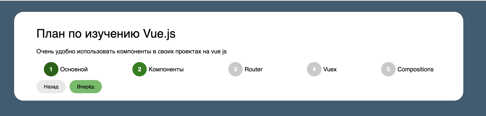

** 🧩 Vue 3 Step Learning Plan ** RU
Интерактивное мини-приложение, разработанное с использованием Vue 3 (Composition API). Этот проект демонстрирует пошаговое изучение ключевых понятий Vue.js с возможностью переключения между этапами и сохранением прогресса в localStorage.

** 🚀 Возможности проекта: **

- 📌 Отображение текущего шага обучения с описанием.

- 🔁 Навигация вперёд и назад по шагам.

- 💾 Автоматическое сохранение текущего шага в localStorage.

- 🔄 Восстановление состояния при перезагрузке страницы.

- ✅ Визуальное отображение текущего статуса шагов (активный, завершённый, предстоящий).

- 💡 Используется Composition API, ref, reactive, computed, watch, onMounted.

** 🛠️ Стек: **

- Vue 3 ( Composition )

- TypeScript

- Vite 7

- CSS

** 🧩 Vue 3 Step Learning Plan **
An interactive mini-application built with Vue 3 (Composition API).
This project demonstrates a step-by-step learning path of core Vue.js concepts, featuring stage navigation and progress saving via localStorage.

** 🚀 Project Features: ** ENG

- 📌 Displays the current learning step with description.

- 🔁 Step navigation: move forward and backward.

- 💾 Automatically saves the current step to localStorage.

- 🔄 Restores state after a page reload.

- ✅ Visual indicators for step status: active, completed, upcoming.

- 💡 Utilizes Composition API, ref, reactive, computed, watch, onMounted.

** 🛠️ Tech Stack: **

- Vue 3 ( Composition )

- TypeScript

- Vite 7

- CSS
